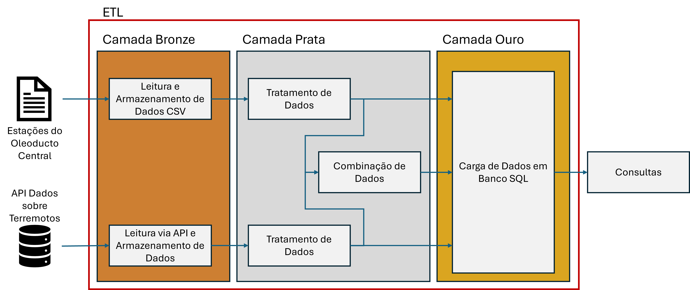

# MVP Sprint - Engenharia de Dados - PUC RIO
# Pipeline de Dados para Análise de ocorrência de terremotos e seus impactos na infraestrutura de transporte de óleo na Colômbia.
**Autor: Fábio Fernandes**

## Contexto
A Colômbia é um país da América do Sul localizado sobre a cadeia dos Andes, uma região montanhosa geologicamente instável, com elevada ocorrência de eventos sísmicos.
_Ver mais em: https://www.dadosmundiais.com/america/colombia/terremotos.php#:~:text=Terremotos%20fortes%20ocorrem%20com%20relativa,s%C3%A3o%20um%20pouco%20mais%20fracas._

Ao mesmo tempo, é um importante produtor e consumidor de petróleo, gás e derivados de petróleo, com uma extensa rede de oleodutos e gasodutos para transporte deste produtos, além de terminais de transporte e tanques de estocagem. Como destaque, o Oleoducto Central é um oleoduto de petróleo bruto, que começa em Cusiana, região produtora, e vai até o terminal marítimo de Coveñas, no Caribe.
_Ver mais em: https://www.ceicdata.com/pt/indicator/colombia/crude-oil-production._
_Ver mais em: https://en-m-wikipedia-org.translate.goog/wiki/Ocensa_pipeline?_x_tr_sl=en&_x_tr_tl=pt&_x_tr_hl=pt&_x_tr_pto=sge#:~:text=O%20oleoduto%20Ocensa%20(%20Oleoducto%20Central,SA%20%2C%20Petrominerales%20e%20Triton%20Colombia._ 

Sabemos que os eventos sísmicos representam um perigo importante para a integridade desta malha logística, especialmente os dutos. De fato, terremotos podem provocar deslizamentos de terra. Caso haja algum duto instalado na área afetada pelo terremoto, diferentes anomalias podem surgir, como amassamentos ou mossas, enrugamento e até mesmo trincas ou rupturas decorrentes dos esforços mecânicos aplicados ao duto. Há muito esforço de pesquisa e desenvolvimento e aplicação de tecnologia para proteger a infraestrutura de transporte de óleo e gás desses riscos geotécnicos.
_Ver mais em: https://asmedigitalcollection.asme.org/ipg_ 

## Objetivos deste trabalho
O objetivo deste trabalho é criar um _pipeline_ de dados que nos permita responder a algumas perguntas relacionadas à ocorrência de terremotos na Colômbia e potenciais impactos na infraestrutura de transporte de óleo, especificamente nas estações que fazem parte do Oleoducto Central. 

### Perguntas a serem respondidas
- Qual a frequência de ocorrências de terremotos com magnitude maior do que 5 na Colômbia?
- Qual a média e o desvio padrão da magnitude destes terremotos?
- Com que frequência um evento sísmico de magnitude maior ou igual a 5 ocorre a menos de 200km de alguma das estações do Oleoducto Central?
- Qual das estações do Oleoducto Central foi mais vezes impactada por terremotos de intensidade maior do que 5?

### Estratégia de Implementação
Este _pipeline_ de dados será implementado na plataforma _Databricks Community Edition_, onde, além dos recursos da plataforma, serão criados e executados algoritmos em Python, organizados nos _notebooks_. Esses algoritmos serão responsáveis por obter dados, organizá-los, transformá-los e finalmente carregá-los em um esquema SQL. Da obtenção dos dados à consulta, utilizaremos a arquitetura _medallion_, onde na camada bronze armazenaremos os dados brutos, na camada prata os dados limpos e transformados, e na camada ouro os dados prontos para consulta.
O produto final é um banco de dados SQL que será utilizado para responder às perguntas, por meio de consultas SQL.

## Pipeline de dados
### Esquema do banco de dados
### Catálogo de dados
## Busca pelos dados
## Coleta e armazenamento de dados
## Transformação dos dados
## Carga dos dados
## Análise
### Qualidade dos dados
### Respostas às perguntas
## Auto avaliação
### Sugestão de próximos passos

O objetivo deste trabalho desenvolver uma aplicação de engenharia de dados que nos permita responder às seguintes questões:
- qual a frequência de ocorrências de terremotos com magnitude maior do que 5 na Colômbia?
- qual a média e o desvio padrão da magnitude destes terremotos?

Mais especificamente, considerando um conjunto de locais de interesse, vamos responder à seguinte pergunta:
- com que frequencia um evento sístimo de intensidade maior ou igual a 5 ocorre a menos de 200km destes pontos de interesse?
- qual destes pontos de interesse foi o mais afetado nos últimos 20 anos?
- 

Links importantes:
Documentação da API do USGS:
query: https://earthquake.usgs.gov/fdsnws/event/1/
output: https://earthquake.usgs.gov/data/comcat/index.php
