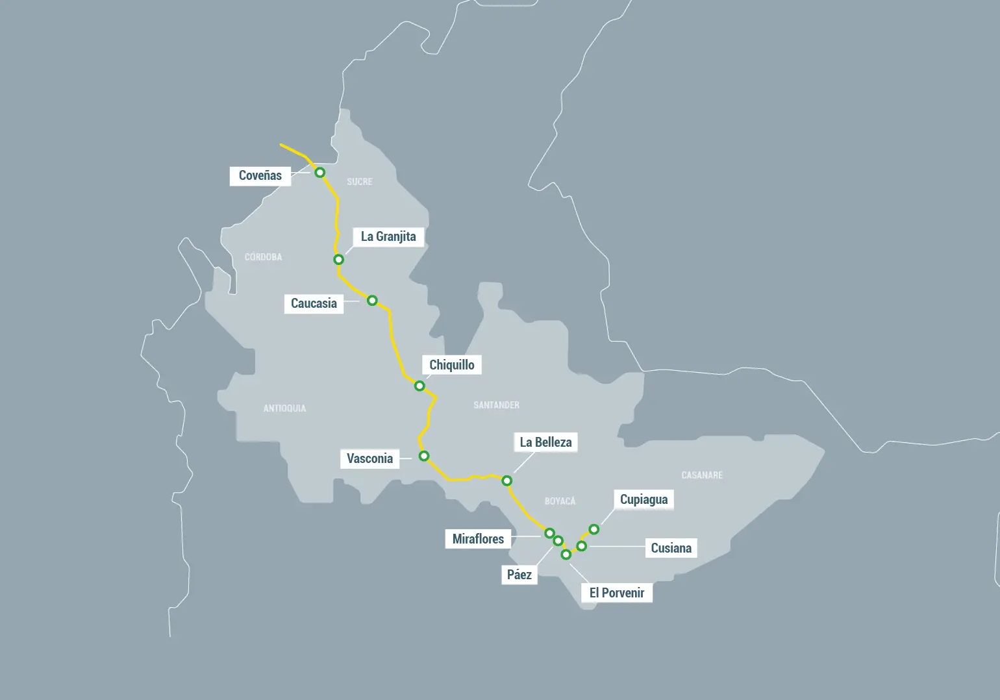
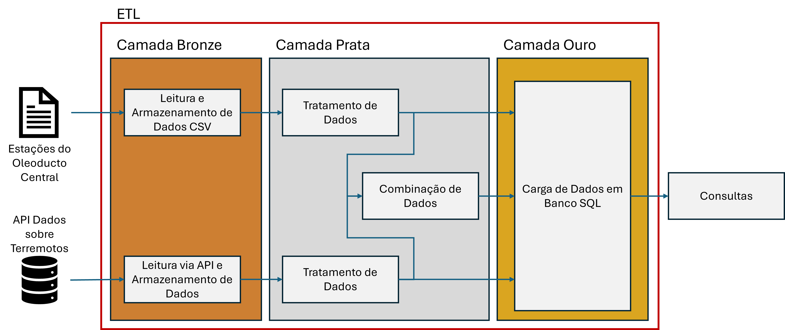
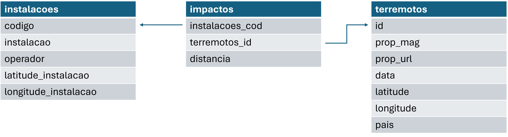

# MVP Sprint - Engenharia de Dados - PUC RIO
# Pipeline de Dados para Análise de ocorrência de terremotos e seus impactos na infraestrutura de transporte de óleo na Colômbia.
**Autor: Fábio Fernandes**

## Contexto
A Colômbia é um país da América do Sul localizado sobre a cadeia dos Andes, uma região montanhosa geologicamente instável, com elevada ocorrência de eventos sísmicos.

Ao mesmo tempo, é um importante produtor e consumidor de petróleo, gás e derivados de petróleo, com uma extensa rede de oleodutos e gasodutos para transporte deste produtos, além de terminais de transporte e tanques de estocagem. Como destaque, o Oleoducto Central é um oleoduto de petróleo bruto, que começa em Cusiana, região produtora, e vai até o terminal marítimo de Coveñas, no Caribe.

_Ver mais em:_ <a href="https://en-m-wikipedia-org.translate.goog/wiki/Ocensa_pipeline?_x_tr_sl=en&_x_tr_tl=pt&_x_tr_hl=pt&_x_tr_pto=sge#:~:text=O%20oleoduto%20Ocensa%20(%20Oleoducto%20Central,SA%20%2C%20Petrominerales%20e%20Triton%20Colombia)">Wikipedia do Oleoducto Central.</a>

Sabemos que os eventos sísmicos representam um perigo importante para a integridade desta malha logística, especialmente os dutos. De fato, terremotos podem provocar deslizamentos de terra. Caso haja algum duto instalado na área afetada pelo terremoto, diferentes anomalias podem surgir, como amassamentos ou mossas, enrugamento e até mesmo trincas ou rupturas decorrentes dos esforços mecânicos aplicados ao duto. Há muito esforço de pesquisa e desenvolvimento e aplicação de tecnologia para proteger a infraestrutura de transporte de óleo e gás desses riscos geotécnicos.
<a href="https://asmedigitalcollection.asme.org/ipg">Clique aqui para saber mais.</a>

## Objetivos deste trabalho
Para responder a algumas perguntas relacionadas à ocorrência de terremotos na Colômbia e potenciais impactos na infraestrutura de transporte de óleo, especificamente nas estações que fazem parte do Oleoducto Central, criamos um _pipeline_ de dados que nos permitiu fazer as consultas necessárias. 

**Os objetivos deste trabalho são documentar a criação deste _pipeline_, refletir sobre os aspectos mais relevantes das escolhas que foram feitas e sugerir caminhos para melhorias.**

### Perguntas a serem respondidas
- Qual a frequência de ocorrências de terremotos com magnitude maior do que 5 na Colômbia?
- Qual a média e o desvio padrão da magnitude destes terremotos?
- Com que frequência um evento sísmico de magnitude maior ou igual a 5 ocorre a menos de 200km de alguma das estações do Oleoducto Central?
- Qual das estações do Oleoducto Central foi mais vezes impactada por terremotos de intensidade maior do que 5?

### Estratégia de Implementação
Este _pipeline_ de dados foi implementado na plataforma _Databricks Community Edition_, onde, além dos recursos da plataforma, foram criados e executados algoritmos em Python, organizados nos _notebooks_. Esses algoritmos são responsáveis por obter dados, organizá-los, transformá-los e finalmente carregá-los em um esquema SQL. Da obtenção dos dados à consulta, utilizamos a arquitetura _medallion_, onde na camada bronze armazenamos os dados brutos; na camada prata, os dados limpos e transformados; e na camada ouro, os dados prontos para consulta.
(_Ver mais sobre medallion architecture aqui: https://www.databricks.com/glossary/medallion-architecture_.)

O produto final é um banco de dados SQL que pode ser utilizado para responder às perguntas, por meio de consultas SQL.

## Pipeline de dados
A imagem a seguir ilustra o pipeline que foi implementado

Duas fontes de dados foram utilizadas: uma com dados básicos sobre as estações do Oleoducto Central, e outra com informações sobre terremotos. Mais adiante discutiremos sobre estas fontes.
A ETL foi construída por um total de 6 _notebooks_, sendo 2 na camada bronze, para leitura e armazenamento dos dados brutos das duas fontes de dados, três na camada prata, sendo 2 para tratamentos dos dados brutos e 1 para combinação dos 2 datasets em um terceiro dataset, e finalmente 1 _notebook_ na camada ouro para criar o esquema SQL e mover os 3 datasets da camada prata para as respectivas tabelas do esquema SQL.

Também foi criado 1 _notebook_ para consulta SQL.

### Esquema do banco de dados
O esquema adotado segue um modelo estrela, com 1 tabela-fato central conectada a 2 tabelas auxiliares. A tabela-fato foi nomeada _impactos_ e relaciona eventos sísmicos (terremotos) a instalações do Oleoducto Central, informando também a distância calculada entre o epicentro do terremoto e a localização da instalação. As tabelas auxiliares foram nomeadas _terremotos_ e _instalacoes_, e trazem mais detalhes respectivamente sobre os terremotos e sobre as instalações. As variáveis _id_ e _codigo_ funcionam como chaves primárias nas respectivas tabelas e como chave estrangeira na tabela _impactos_. 

_Observação: o Databricks Community Edition não permite a criação de esquemas SQL com integridade referencial, ou seja, o uso de chaves primárias e estrangeiras. Essa funcionalidade está disponível na versão paga. No entanto com comandos SQL é possível fazer pesquisa em uma tabela considerando informações em outra tabela. Na camada prata é feita uma checagem da variável id, garantindo que não há registros com variável id nulos, em branco ou duplicados, portanto funcionando como chave primária para a tabela terremotos. Basta uma inspeção visual nos dados das instalações para se assegurar de que a variável codigo também pode ser usada como chave primária na tabela onde constam os dados sobre as instalações._

### Catálogo de dados

#### Informações Gerais
- **Nome do Conjunto de Dados:** Impactos de Terremotos em Instalações do Oleoducto Central.
- **Descrição:** Dados relacionados aos impactos de terremotos nas instalações do Oleoducto Central.
- **Proprietário:** Fábio Fernandes
- **Data de Criação:** 08/04/2025
- **Última Atualização:** 10/04/2025

#### Metadados
- **Fonte dos Dados:** USGS (United States Geological Services), webpage da Ocensa (https://www.ocensa.com.co/nosotros/historia.html) e Google Maps.
- **Formato dos Dados:** SQL
- **Frequência de Atualização:** Não definida
- **Tags:** terremotos, impactos, instalações, desastres naturais, oleodutos

#### Estrutura dos Dados

##### Tabela: impactos
- **Nome da Coluna:** id_impacto
  - **Tipo de Dados:** Integer
  - **Descrição:** Identificador único do impacto
  - **Exemplo de Valor:** 1

- **Nome da Coluna:** id_terremoto
  - **Tipo de Dados:** Integer
  - **Descrição:** Identificador do terremoto (chave estrangeira)
  - **Exemplo de Valor:** 101

- **Nome da Coluna:** id_instalacao
  - **Tipo de Dados:** Integer
  - **Descrição:** Identificador da instalação (chave estrangeira)
  - **Exemplo de Valor:** 202

- **Nome da Coluna:** descricao_impacto
  - **Tipo de Dados:** String
  - **Descrição:** Descrição detalhada do impacto
  - **Exemplo de Valor:** Danos estruturais severos

##### Tabela: terremotos
- **Nome da Coluna:** id_terremoto
  - **Tipo de Dados:** Integer
  - **Descrição:** Identificador único do terremoto
  - **Exemplo de Valor:** 101

- **Nome da Coluna:** data_ocorrencia
  - **Tipo de Dados:** Date
  - **Descrição:** Data de ocorrência do terremoto
  - **Exemplo de Valor:** 2025-03-15

- **Nome da Coluna:** magnitude
  - **Tipo de Dados:** Float
  - **Descrição:** Magnitude do terremoto na escala Richter
  - **Exemplo de Valor:** 7.8

- **Nome da Coluna:** localizacao
  - **Tipo de Dados:** String
  - **Descrição:** Localização do epicentro do terremoto
  - **Exemplo de Valor:** Tokyo, Japão

##### Tabela: instalacoes
- **Nome da Coluna:** id_instalacao
  - **Tipo de Dados:** Integer
  - **Descrição:** Identificador único da instalação
  - **Exemplo de Valor:** 202

- **Nome da Coluna:** nome_instalacao
  - **Tipo de Dados:** String
  - **Descrição:** Nome da instalação
  - **Exemplo de Valor:** Usina Nuclear de Fukushima

- **Nome da Coluna:** tipo_instalacao
  - **Tipo de Dados:** String
  - **Descrição:** Tipo de instalação (ex: hospital, usina, escola)
  - **Exemplo de Valor:** Usina Nuclear

- **Nome da Coluna:** localizacao
  - **Tipo de Dados:** String
  - **Descrição:** Localização da instalação
  - **Exemplo de Valor:** Fukushima, Japão

#### Qualidade dos Dados
- **Completude:** 100%
- **Precisão:** 98%
- **Consistência:** 99%

#### Governança
- **Políticas de Acesso:** Acesso restrito à equipe de pesquisa e análise de desastres
- **Regras de Privacidade:** Dados sensíveis protegidos conforme a LGPD
- **Compliance:** Atende às normas da LGPD

#### Histórico de Alterações
- **Data:** 10/04/2025
- **Alteração:** Criação inicial do catálogo de dados
- **Responsável:** João Pereira

## Busca pelos dados
## Coleta e armazenamento de dados
## Transformação dos dados
## Carga dos dados
## Análise
### Qualidade dos dados
### Respostas às perguntas
## Auto avaliação
### Sugestão de próximos passos

O objetivo deste trabalho desenvolver uma aplicação de engenharia de dados que nos permita responder às seguintes questões:
- qual a frequência de ocorrências de terremotos com magnitude maior do que 5 na Colômbia?
- qual a média e o desvio padrão da magnitude destes terremotos?

Mais especificamente, considerando um conjunto de locais de interesse, vamos responder à seguinte pergunta:
- com que frequencia um evento sístimo de intensidade maior ou igual a 5 ocorre a menos de 200km destes pontos de interesse?
- qual destes pontos de interesse foi o mais afetado nos últimos 20 anos?
- 

Links importantes:
Documentação da API do USGS:
query: https://earthquake.usgs.gov/fdsnws/event/1/
output: https://earthquake.usgs.gov/data/comcat/index.php
